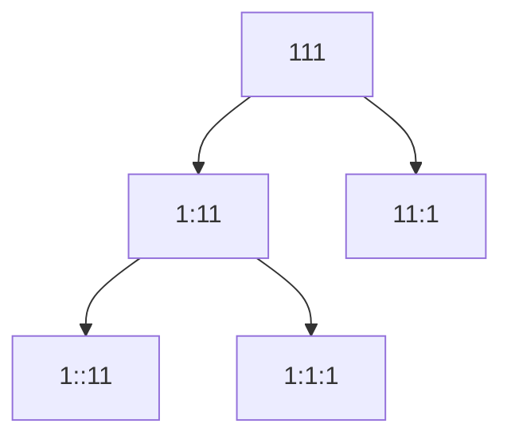
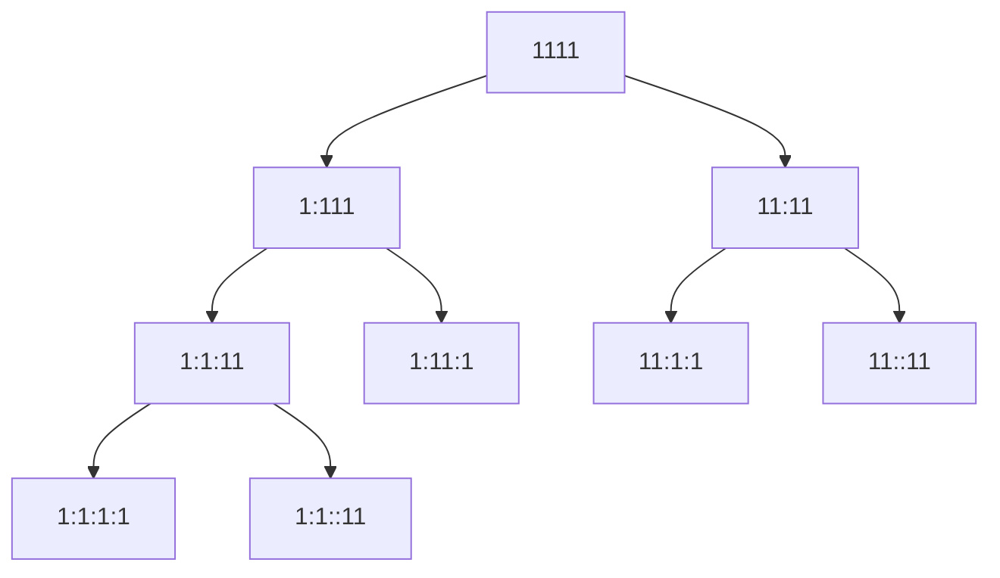

# Implement Decoder for Alphabet-Mapped Numeric Strings

Issue: https://github.com/yumerov/daily-coding-problem/issues/3

## Description

Given the mapping a = 1, b = 2, ... z = 26, and an encoded message, count the number of ways it can be decoded.
For example, the message '111' would give 3, since it could be decoded as 'aaa', 'ka', and 'ak'.
You can assume that the messages are decodable. For example, '001' is not allowed.

## Testing

Simple unit tests.
Run `dotnet test AlphabetMappedNumericStrings.Tests/AlphabetMappedNumericStrings.Tests.csproj` from the repo root.

## Attempts

### Tree building + Leaf counting + Recursion

Example 1:

Example 2:
