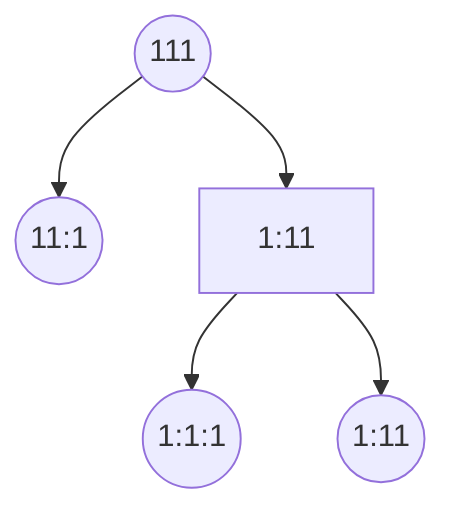
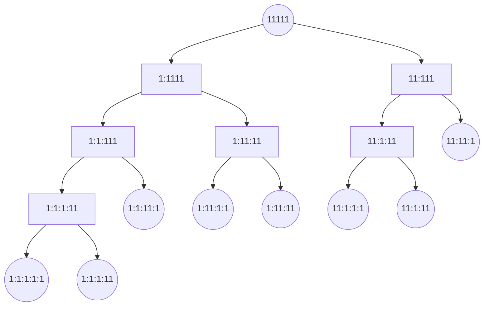

# Implement Decoder for Alphabet-Mapped Numeric Strings

<!-- TOC -->
* [Implement Decoder for Alphabet-Mapped Numeric Strings](#implement-decoder-for-alphabet-mapped-numeric-strings)
  * [Description](#description)
  * [Testing](#testing)
  * [Attempts](#attempts)
    * [Tree building + Leaf counting + Recursion](#tree-building--leaf-counting--recursion)
      * [Example 1](#example-1)
      * [Example 2](#example-2)
<!-- TOC -->

Issue: https://github.com/yumerov/daily-coding-problem/issues/3

## Description

Given the mapping a = 1, b = 2, ... z = 26, and an encoded message, count the number of ways it can be decoded.
For example, the message '111' would give 3, since it could be decoded as 'aaa', 'ka', and 'ak'.
You can assume that the messages are decodable. For example, '001' is not allowed.

## Testing

Simple unit tests.
Run `dotnet test AlphabetMappedNumericStrings.Tests/AlphabetMappedNumericStrings.Tests.csproj` from the repo root.

## Attempts

### Tree building + Leaf counting + Recursion

Using repeating 1s as 11 can be interpreted as 1 and 11.

#### Example 1

#### Example 2

As we can observe, the subtrees repeat themselves in other branches, just like Fibonacci which means without caching/memorization, the time complexity is O(F(N)), where N is the lenght of input string.